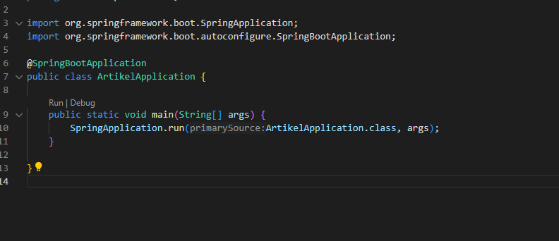
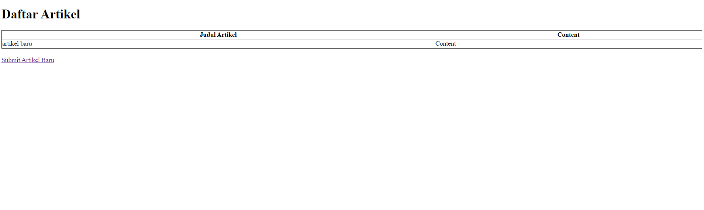
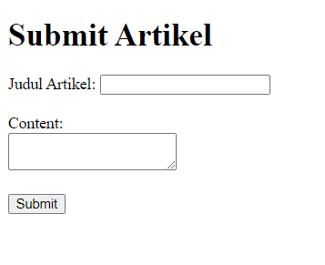
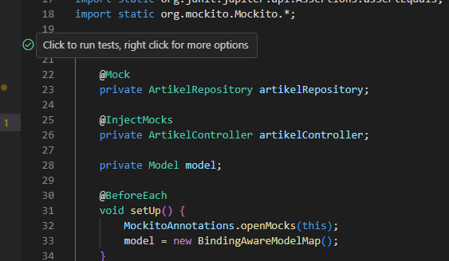

# Getting Started

### How to Start Project

- Manually Create database in mysql name article_db
- start the project click run on src/main/java/com/example/article/ArtikelApplication.java

-

- open (http://localhost:8080/) on chrome

-

- open (http://localhost:8080/submit) on chrome

-

### How to Start Test

- start the project click run on src/main/java/com/example/article/ArtikelControllerTest.java

-
